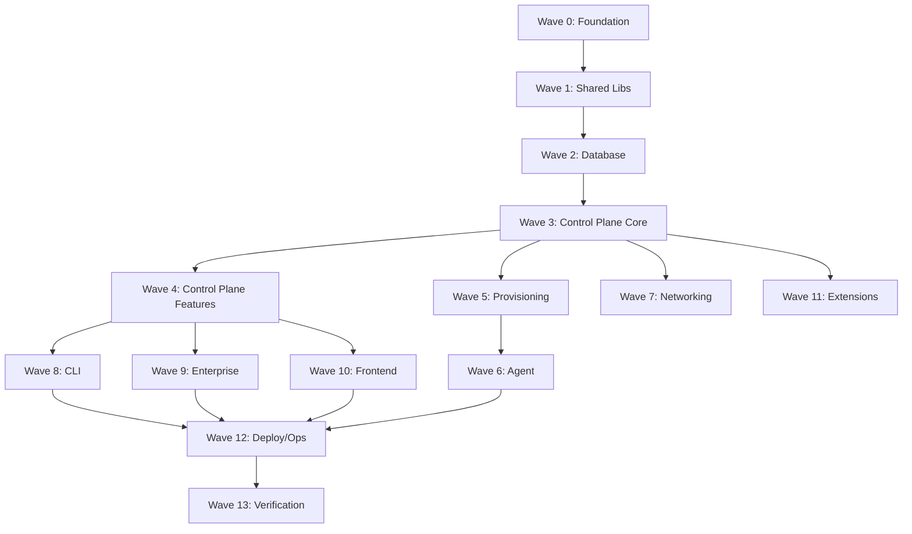

# Phase Plan (13 Waves)

## Dependency Graph

## Wave Summary

| Wave | Name | Tickets | Est. Go Files | Est. TS Files | Parallel Batches |
|------|------|--------:|-------------:|--------------:|-----------------:|
| 0 | Foundation | 8 | 15 | 5 | 2 |
| 1 | Shared Libraries | 12 | 120 | 20 | 3 |
| 2 | Database | 18 | 1,400* | 0 | 4 |
| 3 | Control Plane Core | 22 | 180 | 0 | 4 |
| 4 | Control Plane Features | 28 | 250 | 0 | 5 |
| 5 | Provisioning | 14 | 55 | 5 | 3 |
| 6 | Agent | 16 | 126 | 0 | 3 |
| 7 | Networking | 10 | 55 | 0 | 2 |
| 8 | CLI | 14 | 192 | 0 | 3 |
| 9 | Enterprise | 18 | 114 | 0 | 3 |
| 10 | Frontend | 24 | 0 | 1,800 | 5 |
| 11 | Extensions | 10 | 123 | 0 | 2 |
| 12 | Deploy/Ops | 8 | 80 | 10 | 2 |
| 13 | Verification | 6 | 0 | 0 | 1 |
| **Total** | | **208** | | | |

\* Wave 2 includes generated SQLC output; human-written tickets cover 77 queries + migration strategy.

## Wave 0: Foundation

**Goal:** Bootstrappable repo with build, lint, gen pipeline.

**Exit criteria:**

- `make build` produces `anvil` binary (stub)
- `go.mod` at `github.com/swami086/platform`
- Torbit indexes `cleanroom-platform/src/`
- CI workflow skeleton passes

## Wave 1: Shared Libraries

**Goal:** `clientsdk`, `testkit`, `buildmeta`, `cryptorand`, `archive`, `apiversion`.

**Exit criteria:**

- SDK types match swagger-generated shapes
- Unit tests pass for all shared packages

## Wave 2: Database

**Goal:** `persistence/` with migrations, SQLC queries, `accessgate`.

**Exit criteria:**

- `make gen` succeeds
- Migration up/down on empty DB
- dbauthz equivalent covers all 77 query files

**Sub-batches:**

1. Migration infrastructure (2 tickets)
2. Core entities: users, orgs, roles (4 tickets)
3. Workspaces, templates, builds (4 tickets)
4. Agents, apps, tailnet state (4 tickets)
5. Notifications, audit, AI (4 tickets)

## Wave 3: Control Plane Core

**Goal:** HTTP server boot, auth, RBAC, middleware, health, metrics.

**Hub file:** `controlplane/server.go` (replaces `coderd.go`)

**Exit criteria:**

- Server starts, `/healthz` responds
- Login flow works against test DB
- OAuth2 errors are RFC-compliant

## Wave 4: Control Plane Features

**Goal:** Workspaces, templates, builds, agents API, apps, scheduling, chatd.

**Exit criteria:**

- Integration tests: create template → build workspace → agent registers

## Wave 5: Provisioning

**Goal:** `orchestrator/`, `executor/`, `executor-sdk/`, gRPC protocol.

**Exit criteria:**

- Terraform provision round-trip in test harness

## Wave 6: Agent

**Goal:** `workspace-agent/` full rewrite.

**Exit criteria:**

- Agent connects via mesh, SSH works, apps proxy

## Wave 7: Networking

**Goal:** `mesh/`, `tunnel/`, DERP integration.

**Exit criteria:**

- Tailnet connectivity test passes

## Wave 8: CLI

**Goal:** `terminal/` + `cmd/anvil/`.

**Exit criteria:**

- CLI parity with `coder --help` command tree

## Wave 9: Enterprise

**Goal:** `premium/` packages.

**Exit criteria:**

- License-gated features activate with test license

## Wave 10: Frontend

**Goal:** `console/` (React SPA).

**Exit criteria:**

- `pnpm build` succeeds
- Storybook stories for all pages
- Core user flows work against Wave 4 API

## Wave 11: Extensions

**Goal:** `extensions/` (forge), `ai-gateway/`, `loadtest/`.

## Wave 12: Deploy/Ops

**Goal:** Helm charts, Dockerfiles, CI, `develop.sh` equivalent.

## Wave 13: Verification

**Goal:** Full parity proof.

**Exit criteria:**

- `make test` full suite green
- Dissimilarity check < 15%
- Torbit graph structural parity report
- E2E Playwright suite (license permitting)

## Human Approval Gates

| Gate | After Wave | Review Focus |
|------|------------|--------------|
| G0 | Plan approval | This document + tickets |
| G1 | 0 | Build pipeline |
| G2 | 2 | Schema + auth correctness |
| G3 | 4 | Core product loop |
| G4 | 8 | CLI + API completeness |
| G5 | 10 | UI parity |
| G6 | 13 | Ship decision |
